# RoboND Robotic Inference Project

Robotic Inference using NVidia DIGITS and NVidia Jetson TX2 Development Board

# Classifying banknotes using Neural Network
### (c) Muthanna A. Attyah 
### April 2018

## Abstract
This paper is to present an attempt to use a neural network to classify banknotes as a cheaper alternative to the complicated/costly optical sensor based machines. Neural network based classification will allow faster adoption of newly issued banknotes which will require software training instead of sensor hardware upgrades.

## Introduction

**T**here has been many attempts to use machine learning to help in verifying banknotes \cite{ref1} and decide its fitness \cite{ref2}, the advantage of such approach over the traditional methods using optical sensors is the great flexibility in software based training to adopt new banknotes and start new applications of the solution. Changing out the hardware can be an expensive proposition and may not be an option while changes in the software can have the same or more benefits without the high cost. In this paper GoogLeNet neural network will be trained to classify UAE Banknotes denominations AED 500, 200, 100, 50, 20, 10, and 5. Selected neural network will be evaluated using pre-supplied data from Udacity Project then tested again with web-cam captured data of the actual banknotes.

## Background / Formulation

The selected problem of UAE banknotes has 7 classes (AED 500,200,100,50,20,10, and 5) to be identified, Color images is required to improve recognition of colorful banknotes, smaller resolutions such as 32x32 will not be good enough considering the paper size of a banknote and tiny details in it. Speed of inference needs to be fast considering the big number of banknotes that will need to be checked per second. a 50+ frame per second is acceptable. Inference will be done on a machine that is connected to wall power socket as a result there is no need to consider power saving similar to what usually done with battery operated mobile solutions.

* Fig 1: Metrics of networks running ImageNet on Jetson TX2

 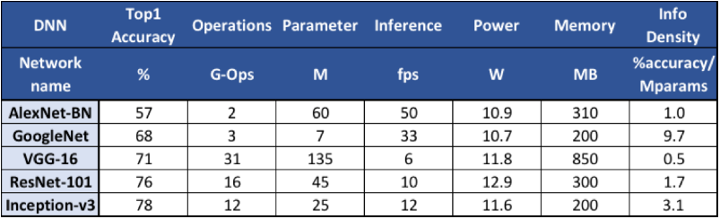 

Comparing the possible parameters of different neural network architectures (see fig.\ref{fig:imagenet_on_tx2}) \cite{ref3} and the requirement mentioned above GoogleNet neural network was found to be a good choice.

## Data Acquisition

Supplied Data from Udacity was having 3 classes (Bottle, Candy Box, Nothing) 

| Class | Images | Image Shape|
|-|-|-|
| Bottle | 3426 | 256x256x3 |
| Candy Box | 1871 | 256x256x3 | 
| Nothing | 2273 | 256x256x3 |
| Total | 7570 |

 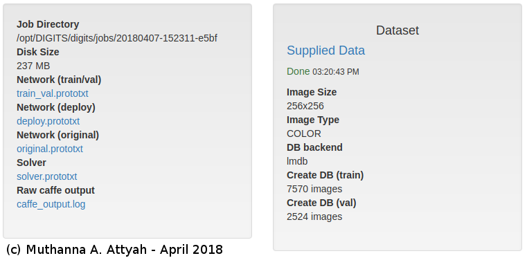 

Captured Data of the different banknotes denominations was collected using a \textbf{Microsoft Life-Cam HD-3000} Web Camera connected to USB port. all images was captured in \textbf{RGB color}, \textbf{640x480} pixels. For each denomination 200 images were captured, 100 for the front side of the banknote and 100 images for the backside.

A total of 1400 images was collected as described in table \ref{table:2}.

| Class | Front Images | Back Images | Image Shape |
|-|-|-|-| 
| AED500 | 100 | 100 | 640x480x3 |
| AED200 | 100 | 100 | 640x480x3 |
| AED100 | 100 | 100 | 640x480x3 |
| AED50 | 100 | 100 | 640x480x3 |
| AED20 | 100 | 100 | 640x480x3 |
| AED10 | 100 | 100 | 640x480x3 |
| AED5 | 100 | 100 | 640x480x3 |
| Total | 700 | 700 | |

Data sizes for each class and total data size for the data folder is as showing in table \ref{table:3}.

| Size | Folder |
|-|-| 
| 67M | Data/AED500 |
| 68M | Data/AED200 |
| 66M | Data/AED100 |
| 65M | Data/AED50 |
| 64M | Data/AED20 |
| 64M | Data/AED10 |
| 65M | Data/AED5 |
| 456M | Data |

 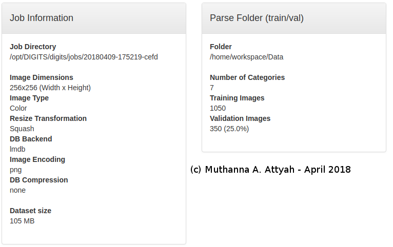 

 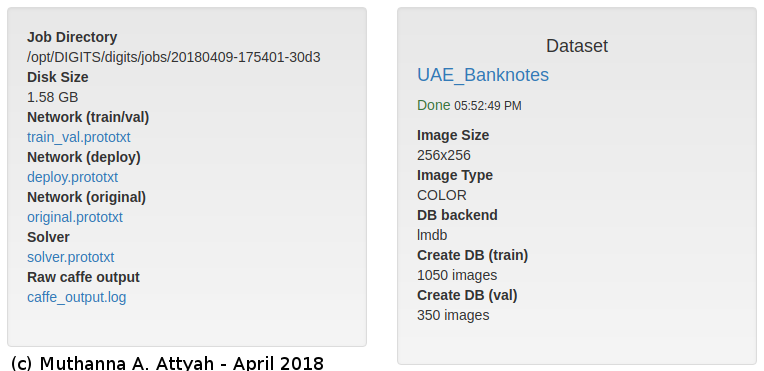 

The 200 images per class was giving good accuracy results and it was selected considering the limited GPU computing time that was available during the training of the model however it can be certainly increased to bigger number if more accuracy was required. All data was captured using python code and OpenCV library; code is as showing in Fig.2

* Fig 2: Python code used to capture data

 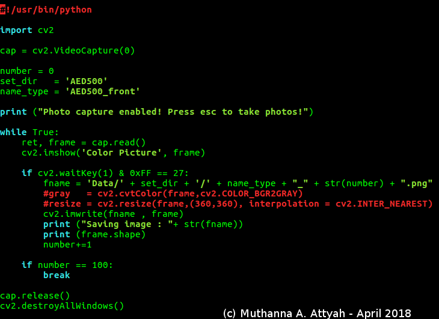 

Color images was collected instead of gray considering the importance of colors to help identify variations in banknotes. Resolution was selected to be 640x480 to ensure that it will be catering to the required neural network input size, resolution can be reduced to the exact required network input size at the time of training. However if required image size can be always reduced at the time of data capturing using the cv2.resize() function from OpenCV. Samples of the collected images are shown in Fig.\ref{fig:GoogLeNet_UAE_Banknote_3}

* Fig 3:Sample images from Banknotes captured data

 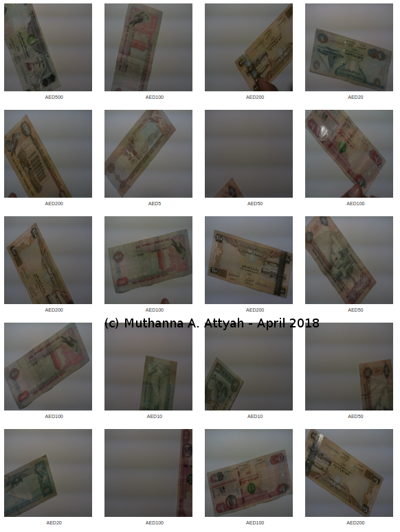 

* Video on how data is collected:

## Results

Results are divided into two parts; the first is using the supplied data from Udacity and second is using the data that was captured using web-cam as explained in above sections.

### Results-Using Supplied Data

Supplied data was used to test both AlexNet and GoogLeNet architectures. Accuracy of GoogLeNet was higher than AlexNet when using the same number of epochs. However both networks was able to achieve the required accuracy greater than 75 percent. Required inference time was better when using AlexNet but again both was able to achieve an inference time of 10 ms or less. Results are as shown in below figures.

* Fig 4: Supplied Data Learning Curves using AlexNet

 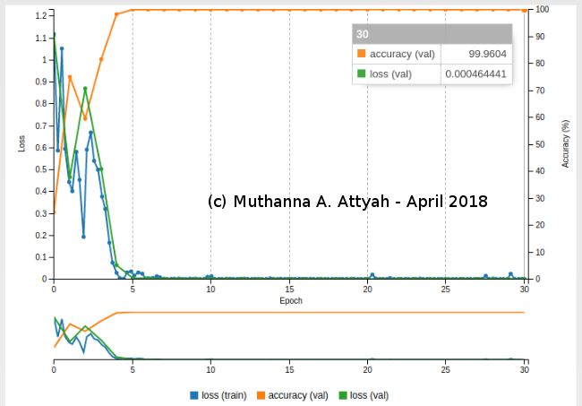 

 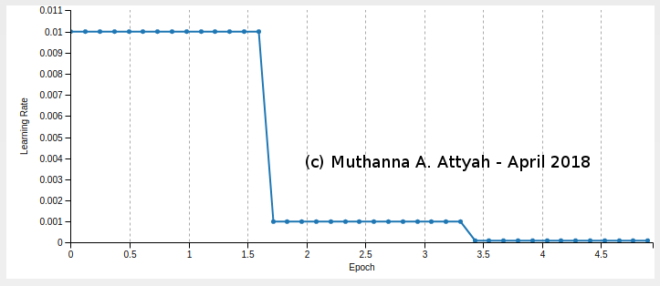 

* Fig 5: Supplied Data Learning Curves using GoogLeNet

 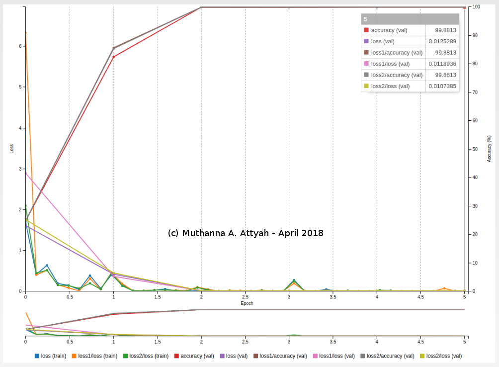 

* Fig 6: Supplied Data Evaluation using AlexNet

 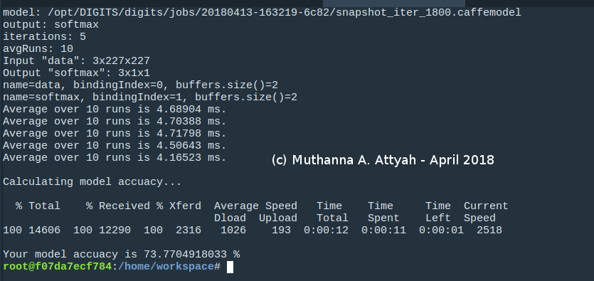 

* Fig 7: Supplied Data Evaluation Results using GoogLeNet

 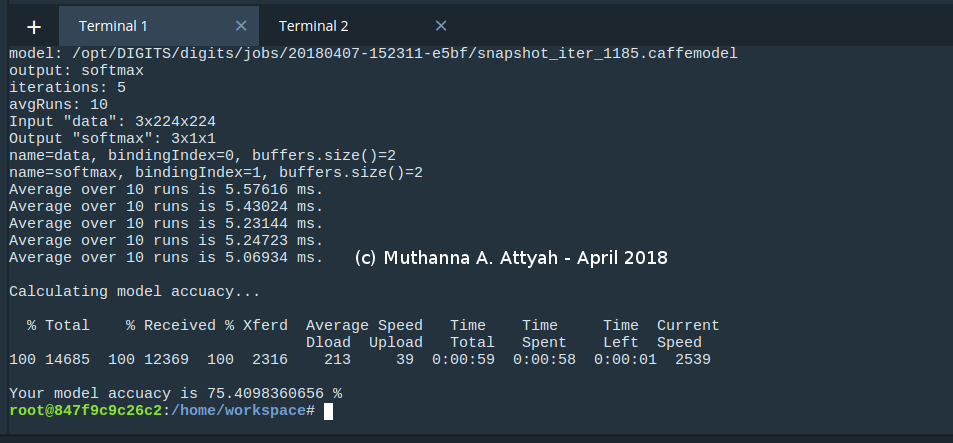 

A single image test was done using GoogLeNet model and the result was as shown below, Identification was correct with 99.83\% confidence:

* Fig 8: Supplied Data Single Image Test

 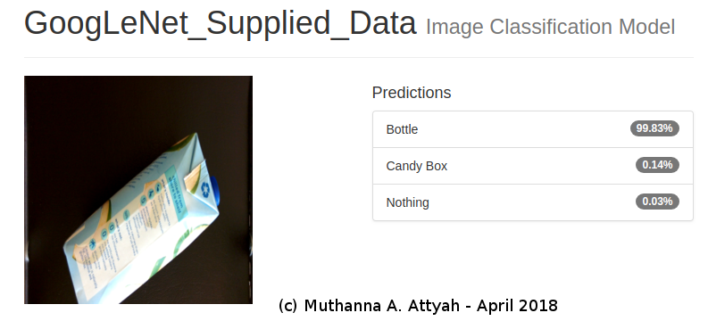 

### Results-Using Captured Data

 AlexNet was tested with captured data but results was not good; 35\% accuracy was the maximum reached when using 50 epochs. 

* Fig 9: Banknotes learning Curves using AlexNet

 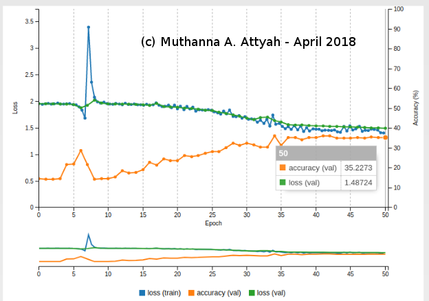 

Considering the very good results obtained when using GoogLeNet network architecture with the Udacity Supplied data, it was decided to use the same network for the banknote classification problem.

* Fig 10: Banknotes Learning Curves using GoogLeNet

 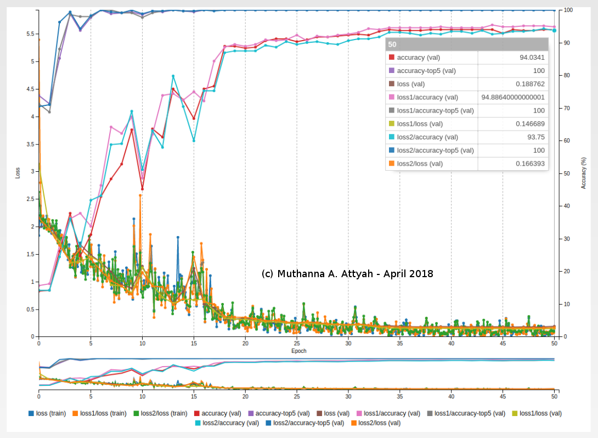 

As it is shown on the learning curves, 94\%+ accuracy was achieved when using 50 epochs which is great when using the captured data for test. 

## Discussion

There was big improvement in obtained accuracy when comparing GoogLeNet network to AlexNet, however the required training time is longer in GoogLeNet and there is additional time when doing inference. Inference time can be improved using optimized software and improved hardware such as Jetson TX2, the JetPack 3.1 and associated TensorRT improved software.

## Conclusion / Future work
GoogLeNet can be used as a viable replacement for the sensor based banknotes classifications machines in many of the applications such as Identifying fake banknotes and deciding its fitness. GoogLeNet accuracy is very good in compare to other networks such as LeNet and ALexNet however this comes with cost of longer time required in both training and inference.

Accuracy can be much improved by adding more captured data per class but again this will require longer training time and more storage space to store the samples.

